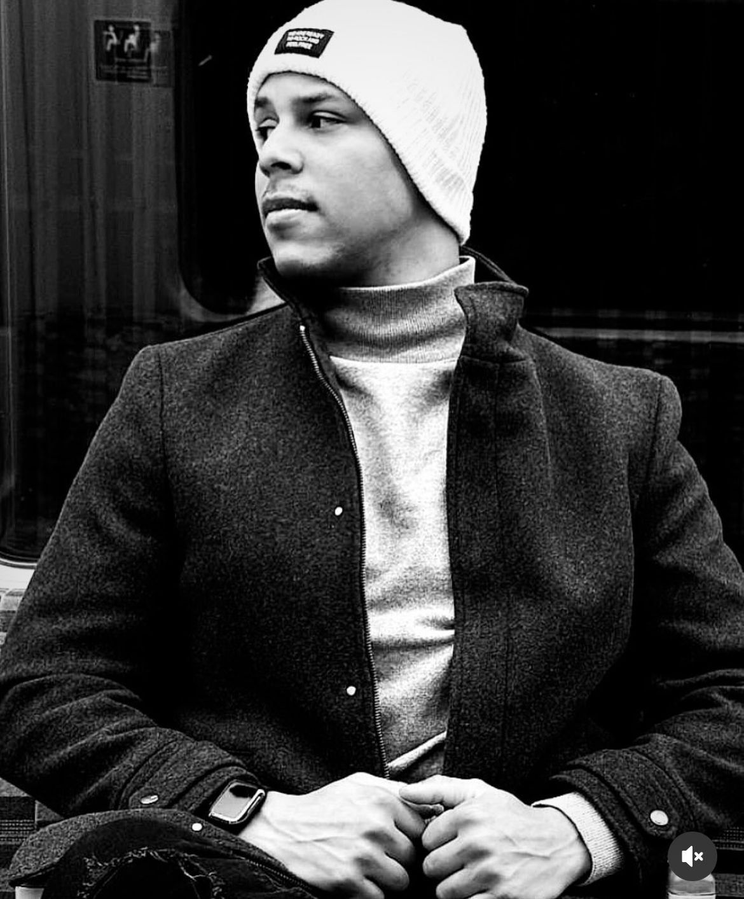

<h1 align="center">💻 Vitor | Portfólio Profissional</h1>

  

  🚀 Desenvolvedor Front-End em evolução para Fullstack  
  🎯 HTML • CSS • JavaScript • Node.js • Angular • Flutter

  
  
  

---

## 📌 Sobre o Projeto

Este é meu portfólio pessoal, desenvolvido com foco em desempenho, estilo futurista e animações interativas. Nele apresento minhas principais **habilidades como desenvolvedor Front-End**, com um gráfico radar animado que mostra minha evolução rumo ao Fullstack.

> Design in
